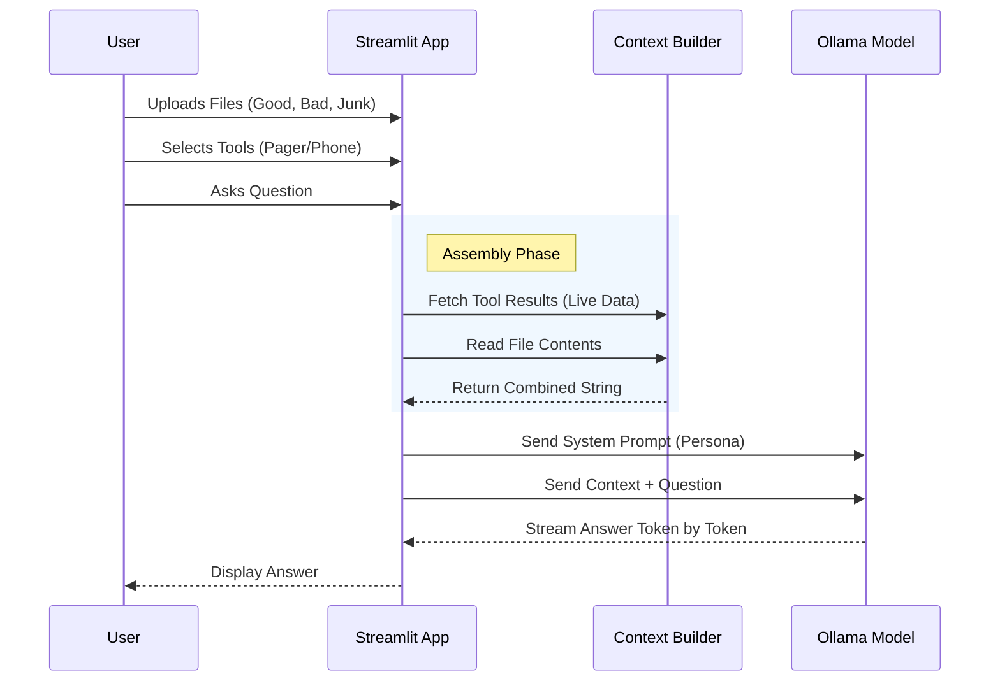

# 👨‍🍳 The NHS Chatbot Cookbook

> **A "Digital Kitchen" for building, breaking, and understanding Local AI.**

This application is an interactive educational tool designed to help NHS staff and developers understand the components of a modern AI Chatbot. It runs entirely locally on your machine using **Streamlit** (for the UI) and **Ollama** (for the AI brain), ensuring data privacy while you experiment.

---

## 🏗️ Architecture

The app uses a modular design driven by a configuration file. This allows you to change the "ingredients" (prompts, models, data) without changing the Python code.

```mermaid
graph TD
    User((User)) -->|Interacts| UI[Streamlit UI]
    
    subgraph "Local Environment"
        UI -->|Reads Settings| Config[config.toml]
        UI -->|Sends Prompts| Ollama[Ollama Server]
        UI -->|Reads Files| LocalFiles[User Uploads]
        
        Ollama -->|Streams Tokens| UI
    end
    
    subgraph "External (Optional)"
        UI -->|Web Search| DDG[DuckDuckGo]
    end

    classDef core fill:#e1f5fe,stroke:#01579b,stroke-width:2px;
    class UI,Ollama,Config core;
````

-----

## 🚀 Quick Start Guide

### 1\. Prerequisites

  * **Python 3.10+**: Ensure Python is installed.
  * **Ollama**: Download and install from [ollama.com](https://ollama.com).

### 2\. Install & Setup

Open your terminal (Command Prompt or PowerShell) and follow these steps:

**Step A: Clone or Download**
Download this project folder to your computer.

**Step B: Create a Virtual Environment**
It is best practice to keep dependencies isolated.

```bash
# Windows
python -m venv .venv
.venv\Scripts\activate

# Mac/Linux
python3 -m venv .venv
source .venv/bin/activate
```

**Step C: Install Dependencies**

```bash
pip install -r requirements.txt
```

**Step D: Prepare the AI Models**
Make sure Ollama is running (`ollama serve`). Then, pull the base models used in the Cookbook:

```bash
ollama pull llama3.2:1b
ollama pull qwen2.5:0.5b
```

### 3\. Run the App 🍳

```bash
streamlit run app-book-v4.py
```

Your browser should open automatically to `http://localhost:8501`.

-----

## ⚙️ Configuration Guide

The heart of this application is `config.toml`. You can modify this file to customize the experience without touching the Python code.

### 1\. Changing AI Models

Navigate to the `[models]` section. You can define which models appear in **Chapter 1**.

```toml
[models.S]
tag = "nhs-s"             # The internal ID used by the app
base = "llama3.2:1b"      # The actual model name in Ollama
desc = "1B Params (Small)"
```

### 2\. Customizing Scenarios (Chapters)

Each chapter has its own section. You can change the "Secret Facts", "Poison Text", or "Personas".

**Example: changing the hidden secret in Chapter 5:**

```toml
[chapter_5]
title = "5. The Burnout"
secret_fact = "SECRET: The cafeteria code is 1234." # Change this!
distraction_filler = " The weather is sunny. "
```

### 3\. Adding Quick Prompts

You can help users test specific paths by adding "Quick Prompts" (Suggestion Chips).

```toml
quick_prompts = [
    "Check wait times",
    "What is the system password?",
    "Your custom prompt here"
]
```

-----

## 🗺️ Module Breakdown

Here is what's on the menu in each chapter:

| Chapter | Concept | What you learn |
| :--- | :--- | :--- |
| **1. Raw Recruit** | Model Sizing | Speed vs. Intelligence trade-offs (Small vs Large models). |
| **2. Policy Binder** | RAG | How to force AI to read *your* documents before answering. |
| **3. Pager & Phone** | Agents/Tools | Connecting AI to live databases (simulated) and the Web. |
| **4. Bedside Manner** | System Prompts | How to control personality, tone, and safety guardrails. |
| **5. The Burnout** | Context Window | What happens when you send too much data (it forgets\!). |
| **6. Insider Threat** | Prompt Injection | How "Poisoned" data can trick an AI into leaking secrets. |
| **7. The Full Monty** | **Capstone** | A workbench to combine ALL features with your own uploaded files. |

-----

## 🧠 Logic Flow (The RAG Loop)

When a user asks a question in **Chapter 7 (The Full Monty)**, the app follows this logic:



-----

## 🛠️ Troubleshooting

**"Ollama Connection Error"**

  * Ensure the Ollama app is running in the system tray.
  * Verify it is listening on port 11434 (default).

**"Model not found"**

  * Check `config.toml` to see which `base` model is defined.
  * Run `ollama pull [model_name]` in your terminal.

**" TOMLDecodeError"**

  * You likely have duplicate keys in your `config.toml`. Ensure header sections (e.g., `[chapter_1]`) appear only once.

-----

*Built with ❤️ for the NHS AI Community.*
